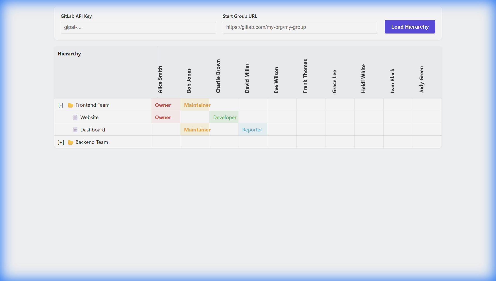

# GitLab Membership Viewer Walkthrough

The application has been implemented as a standalone `index.html` file.

## How to Use

1.  **Open the File**: Double-click `index.html` in your file explorer to open it in your web browser.
2.  **Enter Credentials**:
    *   **GitLab API Key**: Enter your Personal Access Token (PAT). Ensure it has `read_api` scope.
    *   **Start Group URL**: Enter the full URL of the GitLab group you want to visualize (e.g., `https://gitlab.com/my-org/my-group`).
3.  **Load**: Click the "Load Hierarchy" button.
4.  **Interact**:
    *   The table will show the root group initially.
    *   Click the `[+]` icon next to a group name to expand it. This will fetch sub-groups, projects, and members dynamically.
    *   Members are listed in columns.
    *   Cells show the role of each member in the corresponding group/project.

## Features Implemented
*   **Standalone**: No server required.
*   **Lazy Loading**: Fetches data only when you expand a group.
*   **Dynamic Columns**: Adds new members to the table as they are discovered.
*   **Role Visualization**: Displays roles (Owner, Maintainer, etc.) in the grid.
*   **Sticky Header**: The header row remains visible while scrolling.
*   **Rotated Member Names**: Member names in the header are rotated to save horizontal space.

